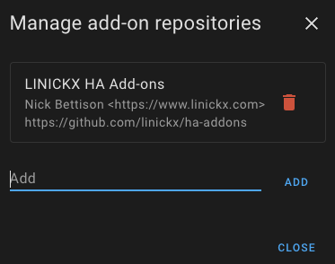

# ha-addons

Welcome to Nick's Home Assistant Add-ons... the LINICKX repository!

## Install via Add-on Store (with custom repository)

You can add this repository to Home Assistant either use the one-click or manually add the repository.

### One Click

The button below uses https://my.home-assistant.io to add my repository to your store, if you have not used my.home-assistant URLs before, the first time you visit it will ask for your Home Assistant URL, change if necessary, this is then stored as a cookie for future use.

### Manually Add the repository

If you'd rather do it manually, on your Home Assistant perform the following:

1. Settings -> Add-ons -> ADD-ON STORE
2. In the top right, select _Repositories_
3. Add https://github.com/linickx/ha-addons

